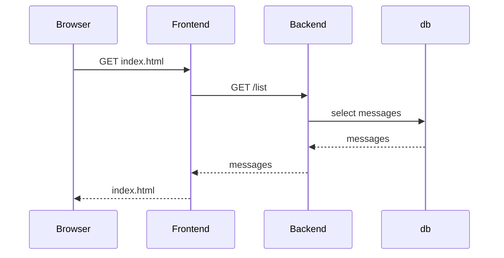
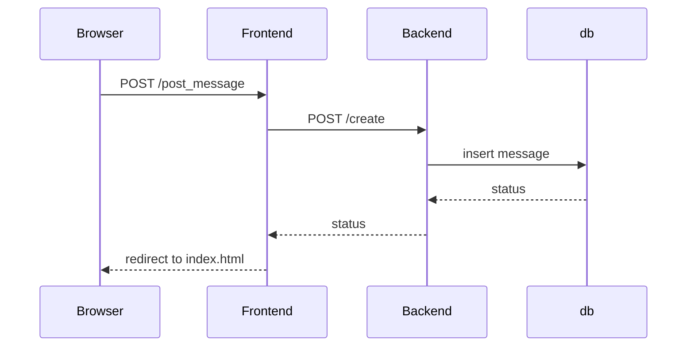
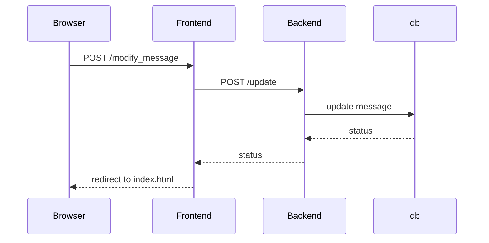
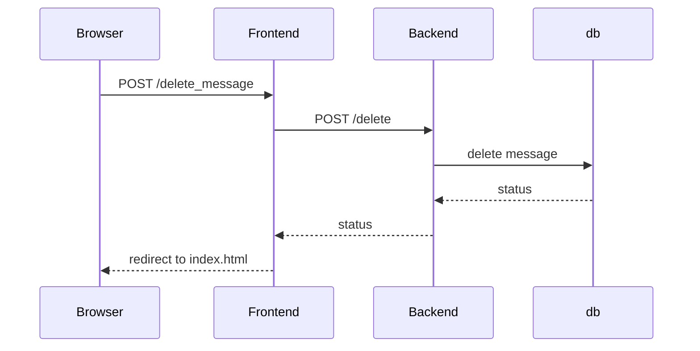

# Kubernetes Messsage Board

A user can connect to application and be presented a text box, they can then write something and send it. All the sent messages will show up in chronological order on the index page.

## First connection

## Sends message

## Modify message

## Delete message

